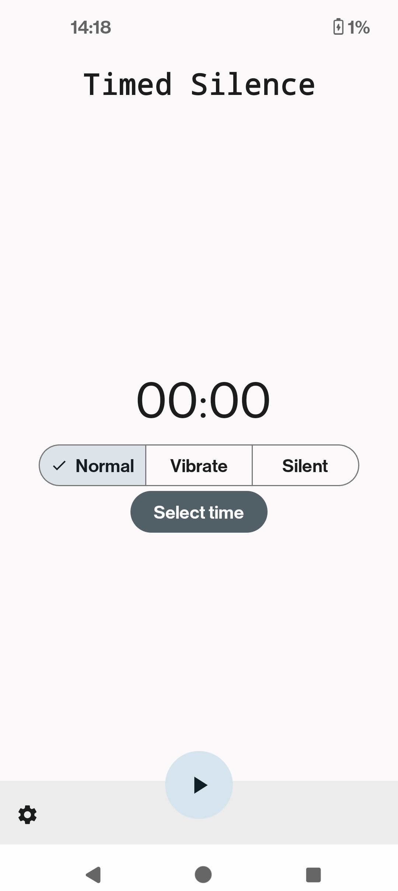

# TimedSilence

This android app lets you schedule ringer mode changes on a scpecific time

## TODO:
- Make an icon for the app
- Change some in app icons
- Add proper options to the bottom sheet
- Schedule multiple alarms and view them in a separate screen
- Add a dialog to explan the user for the permissions
